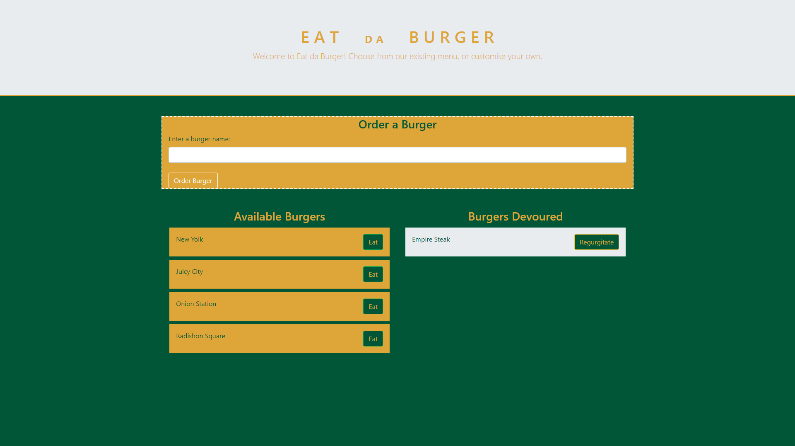

# 13: Eat Da Burger App

## Description
This repo is for Eat Da Burger, a web app that uses the Model-View-Controller paradigm. It makes use of Express, Express Handlebars, and MySQL. The app makes use of a database of `burger` items, each of which has `id`, `name`, and `devoured` properties. On the web page, burgers with the property `devoured=FALSE` are listed on the left, while burgers with the property `devoured=TRUE` are listed on the right.

## How to use it
Users can move burgers from one column to another by clicking the buttons beside the burger names in either list. These buttons toggle the `devoured` property for their associated burger. In addition, a form element allows users to name a new burger and submit it to the database, with the `devoured` property set to `FALSE` by default.

## Deployment
This web app is hoseted on Heroku. It can be visited [here](https://warm-atoll-82512.herokuapp.com/).

## Preview
